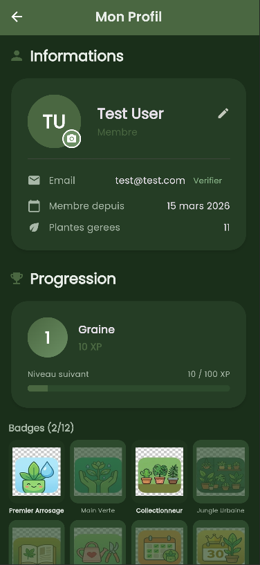
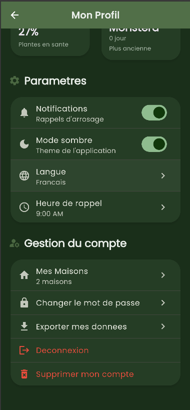
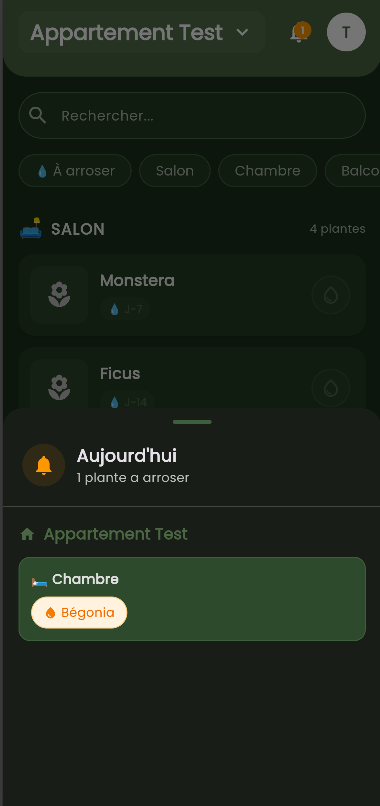
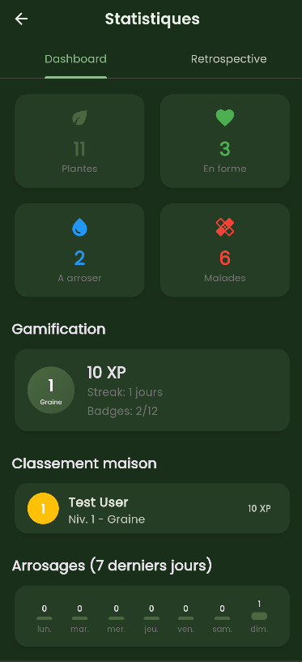
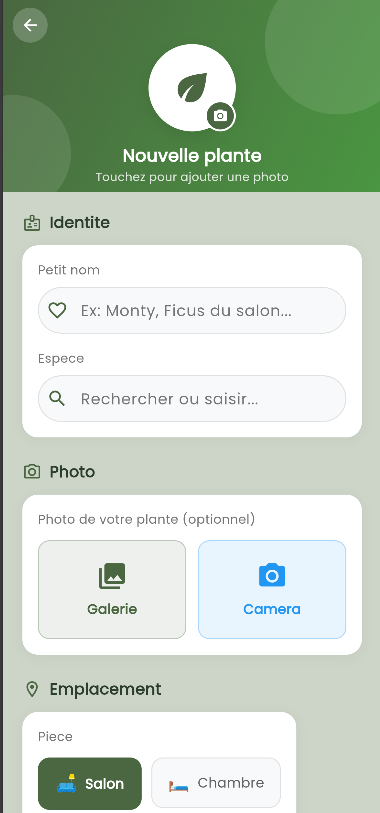

# PLANTO

PLANTO is a full-stack plant management application built with a Quarkus backend and a Flutter client.

This public repository is a portfolio-ready version of a private academic team project originally developed on GitLab. It contains the backend API, the Flutter application, and the main DevOps assets used to run, test, and deploy the project.

## Overview

PLANTO helps users manage indoor plants and shared home spaces through a mobile-first experience backed by a documented REST API.

Main capabilities include:

- JWT authentication with email verification and password reset flows
- House and room management for shared plant organization
- Plant creation, plant details, care logs, and watering workflows
- Plant species search using external plant data providers
- AI-assisted plant identification from photos with Gemini
- Weather-based and species-based care recommendations
- Photo gallery and QR code generation
- Gamification and streak-related features
- Garden and culture management, IoT sensor endpoints, and dashboard statistics
- Push notifications with Firebase Cloud Messaging support

## Screenshots

<p align="center">
  
  
  
</p>
<p align="center">
  
  
</p>

## Tech Stack

### Backend

- Java 21
- Quarkus 3.x
- PostgreSQL
- Flyway
- JWT
- OpenAPI / Swagger
- JUnit 5, Quarkus Test, RestAssured

### Frontend

- Flutter
- Riverpod
- GoRouter
- Dio
- Firebase Messaging
- Flutter Local Notifications

### DevOps

- Docker / Docker Compose
- GitLab CI
- Helm
- Kind
- Kubernetes
- Prometheus / Grafana / Loki

## Repository Structure

```text
.
|-- back/              # Quarkus API, database migrations, tests, Docker, Helm, CI scripts
|-- docs/screenshots/  # GitHub portfolio screenshots
|-- front/             # Flutter application, web/mobile client, UI tests
`-- README.md
```

## Project Context

- Team project originally developed in a private academic repository
- Repackaged here as a public portfolio version
- My contributions covered DevOps and infrastructure work (CI/CD, containerization, Kubernetes, Helm, observability), collaborative backend and integration work, and frontend features including the user profile flow and plant creation experience

## Getting Started

### Prerequisites

- Java 21+
- Docker and Docker Compose
- Flutter SDK

Optional for advanced local infrastructure:

- Kind
- kubectl
- Helm
- Task

## Run the Backend

From `back/`:

```bash
cd back
cp .env.example .env
./scripts/generate-jwt-keys.sh
docker-compose up -d postgres pgadmin
./mvnw quarkus:dev
```

Main local services:

- API: `http://localhost:8080`
- Swagger UI: `http://localhost:8080/q/swagger-ui`
- Health checks: `http://localhost:8080/q/health`
- PostgreSQL: `localhost:5433`
- PgAdmin: `http://localhost:5050`

Default local database credentials are documented in `back/.env.example`.

## Run the Frontend

From `front/`:

Preferred local demo path:

```bash
cd front
docker-compose up --build
```

The web app is then available at `http://localhost:3000`.

Alternative Flutter run for local development:

```bash
cd front
flutter pub get
flutter run --dart-define=GEMINI_API_KEY=your_gemini_api_key_here
```

Note: `front/android/app/google-services.json` is intentionally not included in this public repository. Add your own Firebase configuration if you want to build the Android app locally.

## Frontend / Backend Connection

The Flutter app uses the backend base URL defined in `front/lib/core/constants/app_constants.dart`.

Current local behavior:

- Android emulator: `http://10.0.2.2:8080`
- Web / desktop / iOS simulator: `http://localhost:8080`

If you run the app on a physical device, update the IP configuration accordingly.

## Environment Variables

### Backend

Common local variables:

- `DB_NAME`
- `DB_USER`
- `DB_PASSWORD`
- `DB_PORT`
- `TREFLE_API_TOKEN`

Optional integrations also used in the backend:

- `PERENUAL_API_KEY`
- `GEMINI_API_KEY`
- `OPENWEATHER_API_KEY`
- `MCP_API_KEY`
- `FIREBASE_CREDENTIALS_PATH`

### Frontend

The frontend currently expects:

- `GEMINI_API_KEY` via `--dart-define`

## Testing

### Backend

```bash
cd back
./mvnw test
```

### Frontend

```bash
cd front
flutter test
flutter analyze
```

The frontend also contains additional UI automation assets under `front/maestro/tests`.

## DevOps and Deployment

The backend includes local infrastructure and observability assets such as:

- Docker-based local services
- Helm charts
- Kind configuration
- Taskfile-based workflows
- CI scripts for build and deployment automation
- Monitoring dashboards and alerting resources

See `back/README.md` for the detailed backend and DevOps workflow.

## Team

- Anisse Hamdi
- Ali Can Cebi
- Lucas Lefebvre
